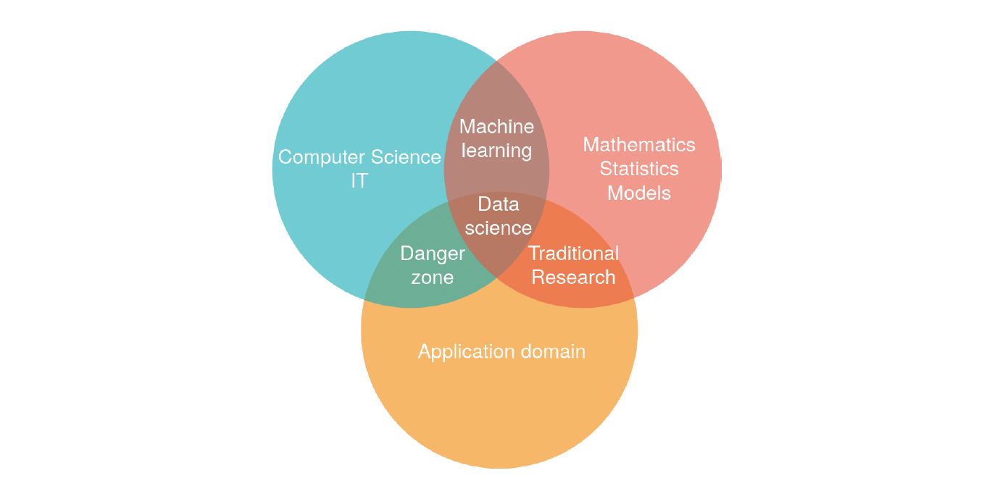
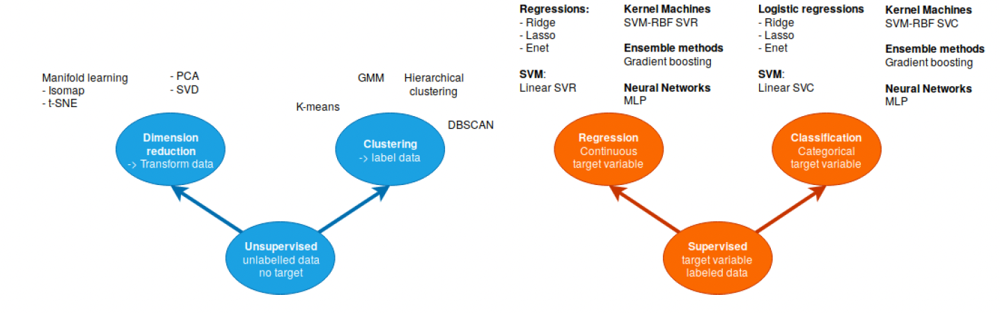

# Introducción

## 1. Ecosistema de Python para data-science

Python es un lenguaje de programación de alto nivel, interpretado y de código abierto. Es multiparadigma, ya que soporta la orientación a objetos, la programación imperativa y, en menor medida, la programación funcional. Además, es dinámico y multiplataforma.

Aunque es posible usar Python de manera global en el equipo, lo más recomendable es crear entornos de desarrollo para cada proyecto. Esto ayuda a evitar conflictos entre las versiones de las librerías utilizadas en cada proyecto.

Existen dos alternativas principales para crear estos entornos: la primera es crear un entorno virtual, y la segunda es utilizar un gestor de paquetes como Conda. En este caso, se utilizará `pip` para la creación de entornos virtuales.

### 1.1 Creación de entornos virtuales

Para crear un entorno virtual, se debe ejecutar el siguiente comando:

```bash
python -m venv nombre_del_entorno
```

Una vez creado el entorno, se debe activar. Para ello, se debe ejecutar el siguiente comando:

```bash
source nombre_del_entorno/bin/activate
```

Para desactivar el entorno, se debe ejecutar el siguiente comando:

```bash
deactivate
```

### 1.2 Instalación de librerías

Para instalar una librería, se debe ejecutar el siguiente comando:

```bash
pip install nombre_de_la_libreria
```

Para instalar una versión específica de una librería, se debe ejecutar el siguiente comando:

```bash
pip install nombre_de_la_libreria==version
```

Para instalar una librería desde un archivo `requirements.txt`, se debe ejecutar el siguiente comando:

```bash
pip install -r requirements.txt
```

Para guardar las librerías instaladas en un archivo `requirements.txt`, se debe ejecutar el siguiente comando:

```bash
pip freeze > requirements.txt
```

### 1.3 Comandos utiles 

Para listar las librerías instaladas, se debe ejecutar el siguiente comando:

```bash
pip freeze
```

Para desinstalar una librería, se debe ejecutar el siguiente comando:

```bash
pip uninstall nombre_de_la_libreria
```

Para actualizar una librería, se debe ejecutar el siguiente comando:

```bash
pip install --upgrade nombre_de_la_libreria
```

Para buscar una librería, se debe ejecutar el siguiente comando:

```bash
pip search nombre_de_la_libreria
```

Para mostrar información de una librería, se debe ejecutar el siguiente comando:

```bash
pip show nombre_de_la_libreria
```

Para mostrar la ayuda de `pip`, se debe ejecutar el siguiente comando:

```bash
pip help
```

Para mostrar la ayuda de un comando específico de `pip`, se debe ejecutar el siguiente comando:

```bash
pip help comando
```

Ademas de esos comandos hay otros tres comandos que son muy útiles a la hora de trabajar con Python.

```bash
python file.py
```

Este comando ejecuta el archivo `file.py` con la versión de Python que se tenga instalada en el sistema.

```bash
python
```

Este comando abre un intérprete de Python en la terminal.

```bash
ipython
```

Este comando abre un intérprete de Python mejorado en la terminal.


## 1.4 Librerías de Python para data-science

Python cuenta con una gran cantidad de librerías para data-science. Algunas de las más utilizadas son:

- **Numpy**: Operaciones numéricas básicas. Operaciones de matrices y algunos solucionadores básicos:

```python
import numpy as np

X = np.array([[1, 2], [3, 4]])
#v = np.array([1, 2]).reshape((2, 1))
v = np.array([1, 2])
np.dot(X, v) # no broadcasting
X * v # broadcasting
np.dot(v, X)
X - X.mean(axis=0)
```

- **Scipy**: Bibliotecas científicas generales con solucionadores avanzados:

```python
import scipy
import scipy.linalg

scipy.linalg.svd(X, full_matrices=False)
```

- **Matplotlib**: Visualización: 

```python
import numpy as np
import matplotlib.pyplot as plt

x = np.linspace(0, 10, 50)
sinus = np.sin(x)
plt.plot(x, sinus)
plt.show()
```
- **Pandas**: Manipulación de datos estructurados (tablas), entrada/salida de archivos Excel, etc.
- **Statsmodel**: Estadísticas avanzadas.
- **Scikit-learn**: Aprendizaje automático.

## Introducción al Machine Learning

### Aprendizaje automático dentro de la ciencia de datos


> Figura 1. Intersección entre Ciencias de la Computación, Matemáticas y Estadísticas, y Dominio de Aplicación.

El aprendizaje automático cubre dos tipos principales de análisis de datos:

1. **Análisis exploratorio**: Aprendizaje no supervisado. Descubre la estructura dentro de los datos.
   Ejemplo: La experiencia (en años en una empresa) y el salario están correlacionados.

2. **Análisis predictivo**: Aprendizaje supervisado.
   Escenario: Una empresa quiere detectar posibles futuros clientes entre una base de prospectos.
   Análisis de datos retrospectivos: revisamos los datos constituidos por empresas prospectadas anteriormente, con sus características. Algunas de estas empresas se convirtieron en clientes, otras no. La pregunta es, ¿podemos predecir cuáles de las nuevas empresas tienen más probabilidades de convertirse en clientes, basándonos en sus características observadas previamente? En este ejemplo, los datos de entrenamiento consisten en un conjunto de n muestras de entrenamiento. Cada muestra, $x_i$, es un vector de $p$ características de entrada (características de la empresa) y una característica objetivo $( y_i \in \{ \text{Yes}, \text{No} \})$.




**Referencias**

- Duchesnay, E., Löfstedt, T., & Younes, F. (2020). *Statistics and Machine Learning in Python: Release 0.3 beta*.
